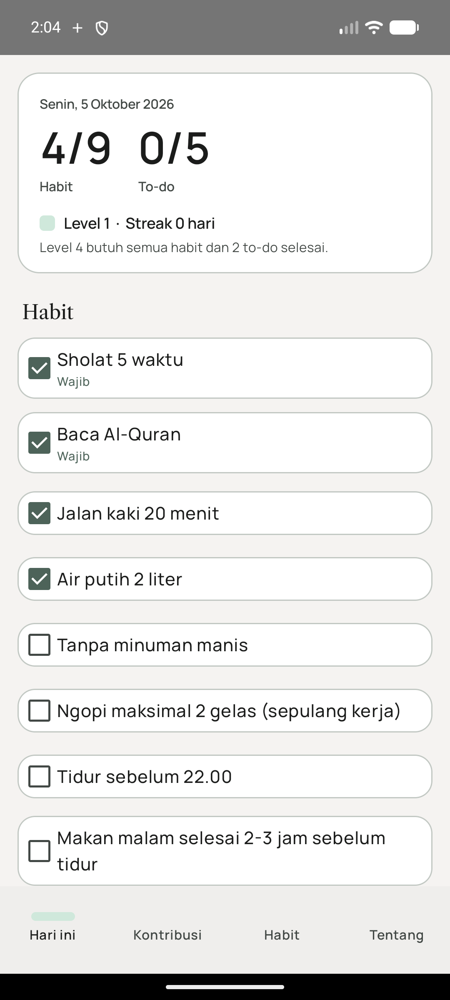
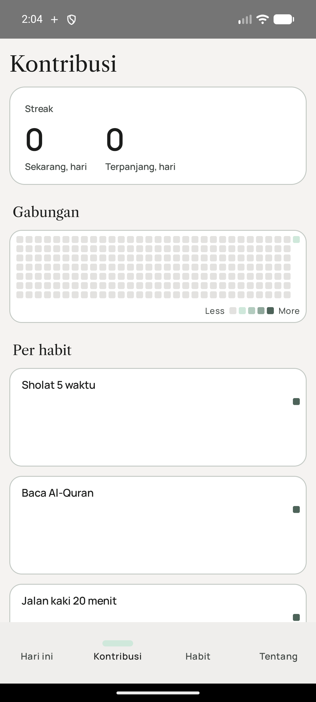
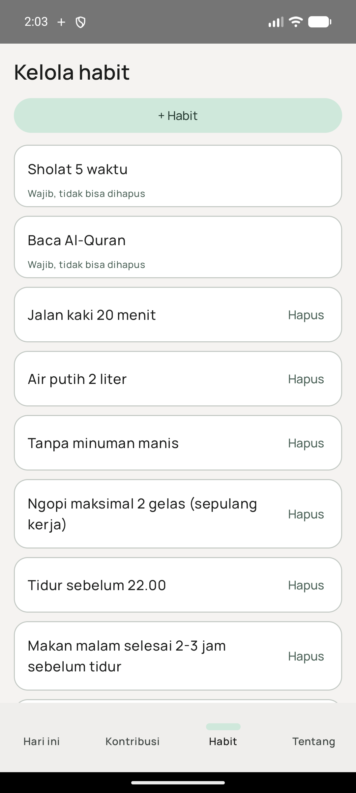

# Habitflow

Aplikasi Android untuk memantau habit harian dan to-do kecil, dengan heatmap kontribusi
ala GitHub. Data disimpan lokal di perangkat, tanpa akun dan tanpa internet.

| Hari ini | Kontribusi | Kelola habit |
|---|---|---|
|  |  |  |

## Fitur

- **Hari ini**: centang habit dan sampai 5 to-do. Level hari (0-4) dan streak langsung terlihat.
  Level 4 butuh semua habit dan minimal 2 to-do selesai.
- **Kontribusi**: heatmap gabungan dan per habit, streak sekarang dan terpanjang. Tap satu
  kotak untuk melihat detail hari itu.
- **Kelola habit**: tambah, ubah nama, dan hapus habit. Habit wajib tidak bisa dihapus.
- To-do yang belum selesai pindah otomatis ke hari berikutnya.

Aturan lengkap ada di [docs/rancangan.md](docs/rancangan.md), dan aturan desain di
[docs/design/README.md](docs/design/README.md).

## Build

Kebutuhan: JDK 17 dan Android SDK (API 34). Lokasi SDK ditulis di `local.properties`:

```properties
sdk.dir=C:/Users/<nama>/AppData/Local/Android/Sdk
```

Debug, langsung dipasang ke emulator atau perangkat yang terhubung:

```sh
JAVA_HOME="<path JDK 17>" ./gradlew.bat installDebug --console=plain
```

Tes unit aturan inti (`domain/`):

```sh
JAVA_HOME="<path JDK 17>" ./gradlew.bat testDebugUnitTest --console=plain
```

### Release

```sh
JAVA_HOME="<path JDK 17>" ./gradlew.bat assembleRelease --console=plain
```

Hasilnya `app/build/outputs/apk/release/app-release.apk`. Build release ditandatangani dengan
keystore di luar repo. Gradle membaca `~/.habitflow/keystore.properties`:

```properties
storeFile=C:/Users/<nama>/.habitflow/habitflow-release.jks
storePassword=...
keyAlias=habitflow
keyPassword=...
```

Lokasi file itu bisa diganti dengan properti Gradle `habitflow.signing`
(misalnya `-Phabitflow.signing=D:/kunci/keystore.properties`). Kalau file tidak ditemukan,
APK release tetap dibuat tetapi tanpa tanda tangan.

## Ikon

Ikon app dibuat oleh `docs/design/ikon/generate.py` (butuh Python dan Pillow). Ubah
script-nya lalu jalankan ulang, jangan mengedit file ikon hasilnya:

```sh
python docs/design/ikon/generate.py
```
